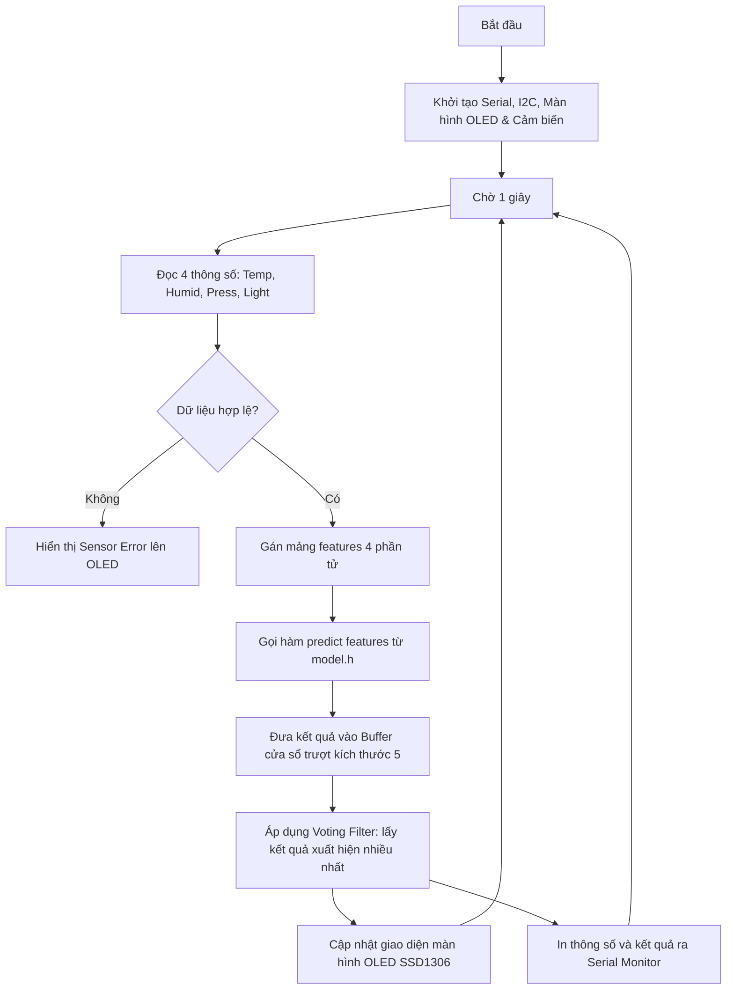

# 🌦️ Trạm Thời Tiết Thông Minh với Machine Learning (Edge AI)

**Hệ thống IoT hoàn chỉnh - Dự đoán thời tiết trực tiếp trên Vi điều khiển ESP8266 bằng thuật toán Random Forest**

  

---

## 🎯 Tổng Quan Dự Án

Dự án này xây dựng một **trạm thời tiết IoT thông minh** tích hợp công nghệ **Edge AI** chạy trên vi điều khiển **ESP8266 NodeMCU v2**. Hệ thống thu thập dữ liệu môi trường thời gian thực, sau đó thực hiện suy diễn ngay trên chip bằng mô hình Machine Learning mà không cần kết nối Cloud hay các dịch vụ bên thứ ba.

### 🚀 Đặc Điểm Nổi Bật
- **Edge AI / TinyML:** Chạy trực tiếp mô hình Random Forest Classifier (từ thư viện `scikit-learn` đã được C-code hóa qua `m2cgen`) trên CPU 32-bit Xtensa 80MHz.
- **Thời Gian Thực (Real-time):** Cập nhật dữ liệu và dự đoán thời tiết mỗi 1 giây.
- **Bộ Lọc Làm Mịn (Voting Filter):** Áp dụng thuật toán bầu chọn đa số (Majority Vote) trên cửa sổ trượt 5 mẫu dự đoán gần nhất để loại bỏ nhiễu cảm biến, giúp kết quả hiển thị cực kỳ ổn định.
- **Tiết Kiệm Tài Nguyên:** Sử dụng tối ưu bộ nhớ vi điều khiển (chỉ ~35.8% RAM và ~27.6% Flash), thời gian suy diễn mô hình cực nhanh chỉ khoảng 5-10ms.
- **Tự Động Huấn Luyện:** Kèm theo script Python tự động tải dữ liệu khí tượng thực tế từ **NASA POWER API** (hoặc tự động tạo dữ liệu mô phỏng dự phòng khi mất mạng) để huấn luyện và tự sinh file header C++ (`model.h`).

---

## 📂 Cấu Trúc Dự Án

```text
he-thong-nhung/
│
├── firmware/                          # Mã nguồn nhúng cho ESP8266 (PlatformIO Project)
│   ├── platformio.ini                # File cấu hình PlatformIO và quản lý thư viện
│   ├── include/
│   │   ├── model.h                   # File mô hình ML chứa hàm predict() (sinh tự động từ Python)
│   │   ├── display.h                 # Khai báo các hàm điều khiển màn hình OLED
│   │   └── sensor_hal.h              # Khai báo cấu trúc dữ liệu và tầng trừu tượng cảm biến
│   └── src/
│       ├── main.cpp                  # Luồng xử lý chính: Khởi tạo, đọc cảm biến, dự đoán & lọc nhiễu
│       ├── display.cpp               # Triển khai vẽ giao diện lên màn hình OLED SSD1306
│       └── sensor_hal.cpp            # Đọc dữ liệu từ DHT11, BMP180, BH1750
│
├── training/                          # Thư mục huấn luyện mô hình ML
│   └── train_model.py                # Script Python tải dữ liệu NASA, huấn luyện mô hình & xuất ra C++
│
├── MODEL_DESCRIPTION.md               # Mô tả chi tiết giải thuật và phân tích lỗi mô hình
└── README.md                          # Hướng dẫn sử dụng dự án (File này)
```

---

## 🔌 Phần Cứng & Kết Nối

Hệ thống sử dụng **3 cảm biến vật lý** để thu thập **4 thông số môi trường** đầu vào cho mô hình Machine Learning:

### 1. Thành Phần Phần Cứng

| Thiết bị / Module | Tên linh kiện | Giao tiếp | Địa chỉ I2C | Vai trò trong hệ thống |
| :--- | :--- | :--- | :--- | :--- |
| **Vi điều khiển** | ESP8266 NodeMCU v2 | - | - | Xử lý trung tâm, chạy mô hình ML và hiển thị dữ liệu |
| **Cảm biến nhiệt/ẩm** | DHT11 | Digital 1-wire | - | Đo nhiệt độ (°C) và độ ẩm tương đối (%) |
| **Cảm biến áp suất** | BMP180 | I2C | **0x77** | Đo áp suất khí quyển tuyệt đối (hPa) |
| **Cảm biến ánh sáng** | BH1750 | I2C | **0x23** | Đo cường độ ánh sáng môi trường (Lux) |
| **Màn hình hiển thị** | SSD1306 OLED (128x64) | I2C | **0x3C** | Hiển thị các thông số thời gian thực và kết quả dự đoán thời tiết |

### 2. Sơ Đồ Đấu Nối Pinout

Tất cả các thiết bị I2C (BMP180, BH1750, SSD1306) dùng chung đường bus I2C trên ESP8266 (chân D1 và D2). Cảm biến DHT11 sử dụng một chân kỹ thuật số độc lập (D3).

```text
                     ┌───────────────────────────────────────┐
                     │          ESP8266 NodeMCU v2           │
                     └─┬─────────┬─────────┬─────────┬───────┘
                       │         │         │         │
                      3V3       GND       D1        D2   D3
                       │         │        (SCL)     (SDA)│
                       ▼         ▼         │         │   ▼
                     ┌─────────────┐       │         │ ┌──────────────┐
                     │ Nguồn chung │       │         │ │ DHT11 Sensor │
                     └─────────────┘       │         │ └──────────────┘
                       │         │         │         │
                       ▼         ▼         ▼         ▼
                     ┌─────────────────────────────────┐
                     │ Đường Bus I2C                   │
                     ├─────────────────────────────────┤
                     │ 🌐 SSD1306 OLED (Địa chỉ 0x3C)  │
                     │ 🌐 BH1750 Light (Địa chỉ 0x23)  │
                     │ 🌐 BMP180 Press (Địa chỉ 0x77)  │
                     └─────────────────────────────────┘
```

**Chi tiết kết nối dây cụ thể:**
- **VCC (3V3)** của DHT11, BMP180, BH1750, SSD1306 nối với chân **3V3** của ESP8266.
- **GND** của DHT11, BMP180, BH1750, SSD1306 nối với chân **GND** của ESP8266.
- **DHT11 Data Pin** nối với chân **D3** (GPIO0) trên ESP8266.
- **SCL Pins** (của BMP180, BH1750, SSD1306) nối chung vào chân **D1** (GPIO5) của ESP8266.
- **SDA Pins** (của BMP180, BH1750, SSD1306) nối chung vào chân **D2** (GPIO4) của ESP8266.

---

## 🤖 Mô Hình Machine Learning

Mô hình được thiết kế để phân loại thời tiết thành **3 lớp**:
- **☀️ Lớp 0 (Sunny - Nắng):** Cường độ ánh sáng cao, độ ẩm thấp, áp suất khí quyển ổn định.
- **🌧️ Lớp 1 (Rain - Mưa):** Cường độ ánh sáng thấp, độ ẩm rất cao, áp suất giảm sâu.
- **☁️ Lớp 2 (Cloudy - Mây):** Điều kiện trung bình, âm u hoặc thời tiết chuyển giao.

### 1. Kiến Trúc & Cấu Hình Mô Hình
- **Thuật toán:** Random Forest Classifier (Rừng cây quyết định).
- **Số lượng cây quyết định (`n_estimators`):** 5 cây.
- **Độ sâu tối đa của cây (`max_depth`):** 3 tầng (nhằm hạn chế dung lượng RAM/Flash và tránh quá khớp - overfitting).
- **Tham số sinh ngẫu nhiên (`random_state`):** 42.

### 2. Dữ Liệu Huấn Luyện (Training Data)
- **Nguồn dữ liệu:** Tự động gọi API của **NASA POWER** để lấy dữ liệu khí tượng thực tế của 5 thành phố lớn (Hà Nội, TP.HCM, Tokyo, New York, Sydney) trong 2 năm 2023 - 2024.
- **Dữ liệu dự phòng:** Nếu kết nối API bị lỗi, chương trình sẽ tự động tạo ra **900 mẫu dữ liệu giả lập chất lượng cao** (chia đều 300 mẫu cho mỗi lớp dựa trên phân phối chuẩn đa biến thực tế) để đảm bảo mô hình luôn được huấn luyện thành công.
- **Số mẫu huấn luyện trong file model mẫu:** 300 mẫu quan sát.
- **Độ chính xác huấn luyện:** **100.00%** (theo comment ghi nhận trong `model.h`).

### 3. Tầm Quan Trọng Của Các Tính Năng (Feature Importance)
Mô hình tự động học và đánh giá mức độ quan trọng của các thông số đầu vào:
- **Cường độ ánh sáng (Light):** ~50% (Yếu tố quan trọng nhất để phân biệt ngày/đêm và nắng/mưa).
- **Độ ẩm (Humidity):** ~39% (Chỉ số quyết định khả năng tạo mưa).
- **Áp suất khí quyển (Pressure):** ~9% (Chỉ số báo trước sự thay đổi của áp thấp nhiệt đới).
- **Nhiệt độ (Temperature):** ~2% (Ít đóng vai trò trong việc phân biệt nắng/mưa/mây ở vùng nhiệt đới).

---

## 💻 Hướng Dẫn Cài Đặt Phần Mềm

### Yêu Cầu Hệ Thống
1. **Python 3.8+** (có trong PATH hệ thống).
2. **PlatformIO Core (CLI hoặc tích hợp trong VS Code)**.
3. Driver USB-to-UART cho ESP8266 (thường là **CH340** hoặc **CP2102** tùy loại board mạch).

### Bước 1: Cài Đặt Thư Viện Python
Mở Terminal/PowerShell và cài đặt các thư viện cần thiết cho việc tải dữ liệu và huấn luyện mô hình:
```bash
pip install pandas numpy scikit-learn m2cgen
```

---

## 🚀 Hướng Dẫn Vận Hành Hệ Thống

### Quy trình 1: Huấn luyện và Sinh Mã C++ Tự Động (Khuyến Nghị)

Nếu bạn muốn cập nhật mô hình hoặc tải lại dữ liệu mới nhất từ NASA:

1. Di chuyển vào thư mục `training`:
   ```bash
   cd training
   ```
2. Chạy file Python để huấn luyện:
   ```bash
   python train_model.py
   ```
   *Script sẽ thực hiện các bước:*
   - Tải dữ liệu vệ tinh từ NASA POWER API.
   - Gán nhãn thời tiết theo các quy tắc khí tượng.
   - Huấn luyện mô hình Random Forest.
   - Tạo code C++ và lưu trực tiếp vào đường dẫn `firmware/include/model.h`.

---

### Quy trình 2: Biên Dịch & Nạp Firmware lên ESP8266

1. Di chuyển vào thư mục dự án nhúng `firmware`:
   ```bash
   cd ../firmware
   ```
2. Kết nối ESP8266 với máy tính bằng cáp Micro USB.
3. Biên dịch và nạp code trực tiếp lên board mạch:
   ```bash
   pio run -t upload
   ```
   *PlatformIO sẽ tự động tải các thư viện cảm biến được khai báo trong `platformio.ini`, biên dịch dự án nhúng và upload file binary lên ESP8266.*

---

### Quy trình 3: Giám Sát Dữ Liệu Thời Gian Thực
Để xem các log dữ liệu in qua cổng Serial monitor:
```bash
pio device monitor -b 115200
```
Màn hình Serial sẽ in các dòng dữ liệu dạng:
```text
--- ESP8266 Weather Station ---
T: 31.2, H: 48.5, P: 1011.8, L: 7250.0 -> Prediction: Sunny
T: 31.0, H: 49.0, P: 1011.7, L: 7100.0 -> Prediction: Sunny
T: 22.5, H: 87.2, P: 1004.5, L: 65.0   -> Prediction: Rain
T: 26.8, H: 65.3, P: 1009.5, L: 380.0  -> Prediction: Cloudy
```
*Để thoát chế độ monitor, bấm tổ hợp phím `Ctrl + C` (hoặc `Ctrl + ]` tùy hệ thống).*

---

## 📊 Cơ Chế Hoạt Động Của Hệ Thống

### 1. Luồng Hoạt Động (System Flow)



### 2. Thuật Toán Lọc Nhiễu (Smoothing Voting Filter)

Để ngăn hiện tượng nhảy kết quả liên tục do cảm biến bị nhiễu tức thời (ví dụ: bóng người lướt qua làm BH1750 giảm đột ngột), mã nguồn nhúng áp dụng một bộ lọc làm mịn cửa sổ trượt kích thước 5:

```text
Mẫu mới nhận (kết quả suy diễn): Rain (1)
                                 │
                                 ▼
Buffer cửa sổ trượt (5 mẫu): [Sunny, Sunny, Sunny, Cloudy, Rain]
                                 │
                                 ├── Bầu chọn: Sunny (3 lần), Cloudy (1 lần), Rain (1 lần)
                                 ▼
Dự đoán được chọn cuối cùng: Sunny (0)
```
Giải thuật này được viết trực tiếp trong file `main.cpp` giúp nâng cao đáng kể độ tin cậy thực tế ngoài môi trường.

---

## ⚠️ Giới Hạn Khi Chạy Trong Nhà & Giải Pháp

Mô hình ML được huấn luyện dựa trên dữ liệu thời tiết **ngoài trời** của NASA. Khi bạn mang thiết bị chạy thử **trong nhà**, một số trường hợp sai lệch có thể xảy ra:

### ❌ Tình Huống Dự Đoán Sai Đặc Trưng
- **Hiện tượng:** Bạn ở trong phòng kín bật điều hòa nhiệt độ thấp, rèm cửa che bớt ánh sáng khiến phòng tối. Cảm biến đọc được: Ánh sáng thấp (`Light < 243 Lux`), Áp suất giảm do hệ thống thông gió (`Pressure < 1007.5 hPa`).
- **Mô hình kết luận:** **🌧️ RAIN (Mưa)**.
- **Thực tế:** Ngoài trời hoàn toàn khô ráo và nắng!

### 🔧 Các Hướng Cải Tiến Đề Xuất
1. **Đặt Cảm Biến Ở Vị Trí Phù Hợp:** Đặt cảm biến ánh sáng và áp suất ở sát cửa sổ hoặc ban công để đo đúng cường độ ánh sáng tự nhiên.
2. **Logic Cứng Cường Hóa (Hybrid Rules):** Sửa đổi hàm `loop()` trong `main.cpp` để giới hạn cứng. Ví dụ: Chỉ dự đoán Rain khi đồng thời độ ẩm phải lớn hơn 75% (`humidity > 75`).
3. **Huấn Luyện Lớp "Trong Nhà" (Indoor Class):** Thu thập thêm dữ liệu môi trường trong nhà và gán nhãn lớp thứ 4 (Indoor) để mô hình học cách bỏ qua các trạng thái nhiễu này.

---

## 🔧 Phụ Lục: Các Lệnh Cần Thiết Trong PlatformIO

Dưới đây là bảng tra cứu nhanh các câu lệnh CLI hữu ích khi làm việc với PlatformIO:

| Mục tiêu | Câu lệnh |
| :--- | :--- |
| **Xem danh sách cổng COM kết nối** | `pio device list` |
| **Biên dịch thử firmware (Không nạp)** | `pio run` |
| **Biên dịch và nạp code** | `pio run -t upload` |
| **Nạp code qua cổng COM cụ thể** | `pio run -t upload --upload-port COM10` |
| **Dọn dẹp các file rác sinh ra khi build** | `pio run --target clean` |
| **Mở monitor xem log ở tốc độ 115200** | `pio device monitor -b 115200` |

---

## 📚 Tài Liệu Tham Khảo

- Thư viện C-code hóa mô hình Machine Learning: [m2cgen GitHub](https://github.com/BayesWitnesses/m2cgen).
- Cơ sở dữ liệu khí tượng vệ tinh: [NASA POWER API Portal](https://power.larc.nasa.gov/).
- Thư viện đọc cảm biến: [Adafruit DHT Sensor](https://github.com/adafruit/DHT-sensor-library), [Adafruit BMP085](https://github.com/adafruit/Adafruit-BMP085-Library), [BH1750 Light Library](https://github.com/claws/BH1750).
- Hệ điều hành & Thư viện vẽ OLED: [Adafruit SSD1306 Driver](https://github.com/adafruit/Adafruit_SSD1306).